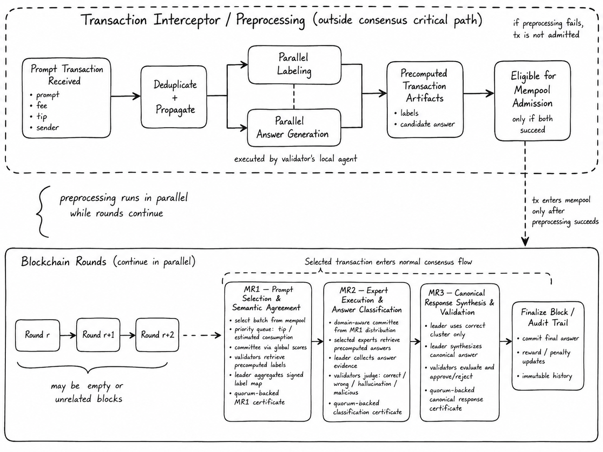
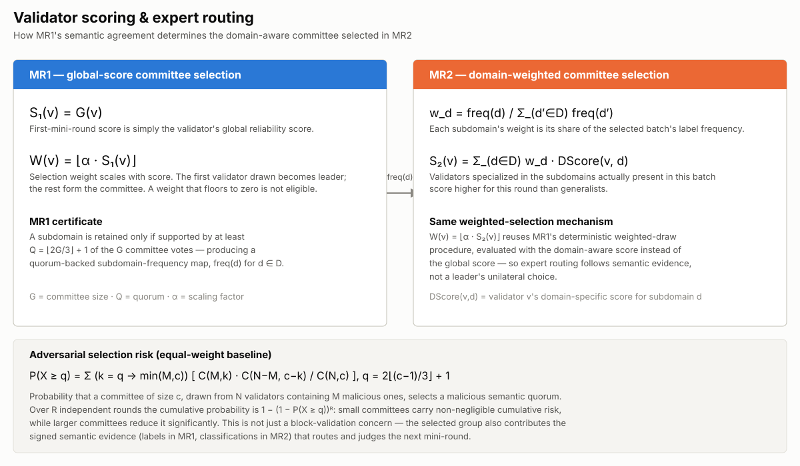
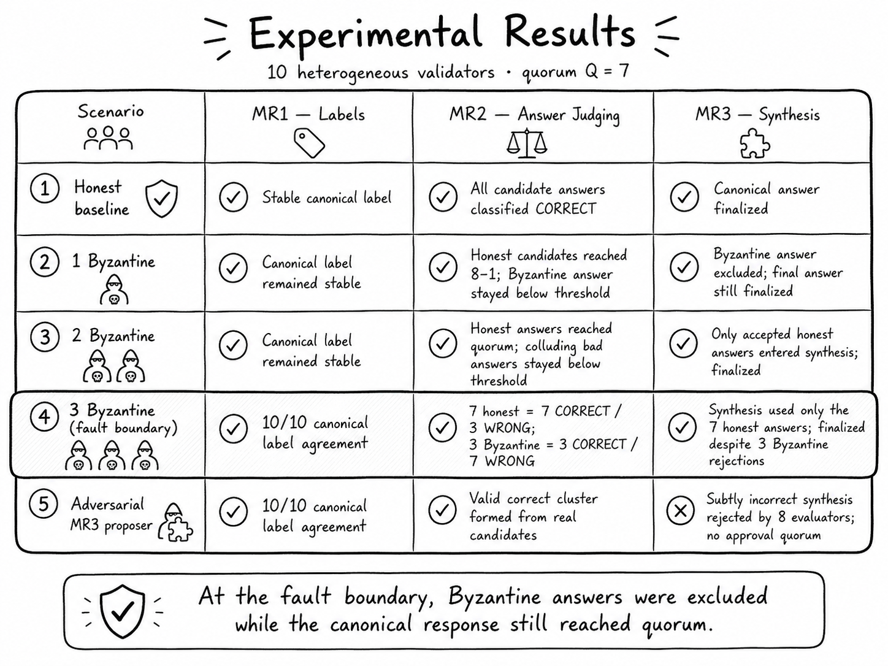

# MoA Chain

MoA Chain is a blockchain protocol for **decentralized Mixture-of-Agents (MoA) inference**. Instead of routing prompts through a single centralized orchestrator, MoA Chain treats user prompts as signed blockchain transactions and moves prompt routing, expert selection, answer aggregation, and canonical-response synthesis into a validator-governed consensus protocol.

Conventional MoA systems combine responses from multiple LLM agents but still depend on one coordinating entity to select agents, distribute prompts, and produce the final output. MoA Chain removes that single point of control: a committee of validators — each running its own independently operated agent — reaches quorum-backed agreement at every stage of the pipeline, from semantic labeling to the final synthesized answer. Because LLM outputs are inherently non-deterministic, the protocol never commits raw model output as chain state directly; labels, classifications, and canonical responses only become protocol state once they are signed by validators and aggregated into a deterministic, verifiable certificate.

This repository contains the Go implementation of the protocol (consensus, mempool, transaction lifecycle, local chain simulator, and block explorer backend) together with `agent-python`, the FastAPI service each validator runs to label, answer, and judge prompts against a real LLM provider (OpenAI, Anthropic, Gemini, DeepSeek, or Ollama).

## Architecture



Prompt transactions are intercepted and preprocessed **outside** the consensus critical path: each validator's attached agent labels the prompt and generates a candidate answer concurrently, in the background, while the chain keeps producing blocks. A transaction only becomes eligible for the mempool once both operations succeed locally — so every transaction that reaches consensus already has the semantic data the protocol needs.

The core design problem MoA Chain solves is reconciling two incompatible execution models: blockchain consensus expects deterministic state transitions, while LLM agents are inherently non-deterministic — two honest validators can produce different labels or differently-worded but semantically equivalent answers. MoA Chain never commits raw model output as chain state; it separates deterministic block validation from semantic agreement, and labels, classifications, and canonical-response decisions become protocol state **only** once they are represented as signed validator evidence and pass quorum aggregation with deterministic certificate verification.

### Prompt transactions & the mempool

Each user prompt is a signed transaction — sender, nonce, value, signature, and transaction hash, plus the prompt text, an output-token limit, a thinking-mode budget, an estimated consumption, an estimated fee, a tip, and protocol-defined semantic labels. The sender signs the transaction hash with Ed25519, binding the request and its cost to an accountable wallet. Estimated consumption, fee, and priority are computed deterministically:

```
Ĉ(tx)        = Tp(tx) + To(tx) + Tm(tx)        # prompt tokens + output limit + thinking-mode budget
F̂(tx)        = Fb + pu · Ĉ(tx)                  # base fee + unit price × estimated consumption
priority(tx) = tip(tx) / Ĉ(tx)                  # higher tip, lower cost → higher priority
```

The mempool indexes pending transactions by hash and by sender (ordered by nonce), and the batch proposed in MR1 is built by a deterministic heap-based selection: only the first eligible transaction per sender is considered at a time, popped in descending priority order, and admitted while it stays within the block's consumption limit — so every validator arrives at the same batch independently.

### MR1 — Prompt selection & semantic label agreement

A committee is elected deterministically from validator global scores (`S₁(v) = G(v)`); the first-selected validator becomes leader. The leader proposes a block built from the selection algorithm above; each committee member independently verifies block structure, ordering, economic validity, and nonce continuity, then retrieves its locally precomputed label for every selected transaction and returns a signed transaction-to-label map. The leader waits for all committee votes up to a configurable deadline — to stop a fast Byzantine minority from dominating the certificate — after which at least `Q = ⌊2G/3⌋ + 1` valid votes are required. A subdomain is retained in the final map only if at least `Q` validators agree on it; every validator then independently recomputes the aggregation and finalizes only if it matches the leader's certificate.

### Validator scoring & expert routing



MR1's finalized subdomain-frequency map directly determines the domain-aware committee for MR2: each subdomain's normalized frequency weights a validator's domain-specific score into `S₂(v)`, so validators specialized in the subdomains actually present in the batch are more likely to be selected — without the leader unilaterally choosing the experts. Both mini-rounds reuse the same deterministic weighted-draw procedure (`W(v) = ⌊α · S(v)⌋`), just with a different scoring function. Because the selected committee doesn't only validate deterministic block data but also contributes the signed semantic evidence used to route and judge the *next* mini-round, committee size carries a real security trade-off: the diagram above works out the hypergeometric probability of drawing a malicious semantic quorum, and how it compounds over repeated rounds.

### MR2 — Expert execution & answer classification

The domain-aware committee retrieves its precomputed candidate answer for each admitted transaction, and the leader assembles a signed answer-evidence certificate once enough execution results arrive. Unlike answer generation, classification is a *live* semantic operation: every validator uses its own LLM as a protocol-defined judge and assigns each candidate to exactly one of four categories — `CORRECT`, `WRONG`, `HALLUCINATION`, or `MALICIOUS` — as a signed vote, not a deterministic output. A candidate enters the canonical correct group once it collects at least `Q` `CORRECT` votes; a transaction only proceeds to MR3 if its correct group reaches that size. As in MR1, every validator independently recomputes the aggregation and only finalizes if it matches the certificate.

### MR3 — Canonical response synthesis & validation

The MR3 leader synthesizes one canonical response using only the transaction's MR2 correct group — wrong, hallucinated, and malicious candidates are kept for auditability but excluded from synthesis — and broadcasts the proposal with the MR2 evidence it was built from. Each validator independently judges whether the synthesis is faithful to the quorum-validated answers and signs an accept/reject vote; the response is finalized only once approval reaches quorum, and reward/penalty updates follow from the outcome. The MR3 leader can *propose* the final answer but never unilaterally *determine* it — see the adversarial-proposer result below.

Non-deterministic LLM output never becomes chain state on its own — only signed, quorum-verified evidence does.

## Results



The full transaction lifecycle was evaluated end-to-end with **10 real heterogeneous validators** — three OpenAI (`gpt-5.4-mini` ×2, `gpt-5-mini`), three Anthropic (`claude-haiku-4-5` ×2, `claude-sonnet-5`), two Gemini (`gemini-3.6-flash`), and two DeepSeek (`deepseek-v4-flash`, `deepseek-v4-pro`) — at quorum `Q = 7`, across an honest baseline and progressively adversarial configurations up to the `f = 3` Byzantine fault boundary:

- In every scenario up to and including the fault boundary, Byzantine answers were correctly excluded from the correct group in MR2, and the canonical response still reached approval quorum in MR3 despite the Byzantine validators voting to reject it.
- A separate experiment forced an adversarial MR3 proposer to synthesize a subtly incorrect canonical response; the committee's independent semantic evaluation caught it, all eight honest evaluators rejected the proposal, and approval quorum became impossible — demonstrating that the MR3 leader can propose but not unilaterally determine the final answer.

The complete run-by-run experimental log — including per-run lifecycle timing, MR1/MR2/MR3 breakdowns, and per-validator preprocessing detail — is in [`agent-python/testresults/real-agents/README.md`](agent-python/testresults/real-agents/README.md).

## Repository map

- `cmd/node`, `cmd/localchain`, `cmd/experiment` — node, local-simulator, and experiment-runner entry points
- `consensus/miniround1`, `consensus/miniround2`, `consensus/miniround3` — the three mini-round implementations
- `mempool`, `transactionprocessing`, `blockprocessing` — transaction lifecycle and block assembly
- `localchain` — self-contained multi-node simulator used for local runs and the explorer backend
- `explorer` — HTTP API backing the block explorer UI
- `validators` — validator scoring, committee selection, and staking
- `agent` / `agent/httpclient` — Go client the protocol uses to talk to `agent-python`
- `agent-python` — FastAPI agent service (labeling, answering, judging) with OpenAI, Anthropic, Gemini, DeepSeek, and Ollama providers
- `experiment` — experiment configuration loading and run recording (manifest, timeline, per-round artifacts)
- `integrationtests` — deterministic, real-agent, and distributed protocol tests
- `testresults`, `agent-python/testresults` — retained experiment reports and analysis
- `scripts` — local and multi-host cluster lifecycle helpers
- `docs/images` — README assets

## Getting started

Running a full 10-validator instance locally takes two processes: the agent servers (one per validator, each backed by a real LLM provider) and the chain itself.

**Prerequisites**

- Go 1.23+
- Python 3.11+ (for `agent-python`)
- API keys for OpenAI, Anthropic, Gemini, and DeepSeek (the default local config uses all four providers)

**1. Install the agent service**

```sh
cd agent-python && make install
```

**2. Start the 10 agent servers**

From the repository root, in one terminal:

```sh
export OPENAI_API_KEY=sk-...
export ANTHROPIC_API_KEY=sk-ant-...
export GEMINI_API_KEY=...
export DEEPSEEK_API_KEY=...
make localchain-agents
```

This starts one `agent-python` process per validator on ports `8100`–`8109`. It runs in the foreground — leave the terminal open and use Ctrl-C to stop all 10 agents together.

**3. Start the local chain**

In a second terminal:

```sh
make localchain
```

This starts a 10-node local chain (quorum `Q = 7`), pointed at the same validator/provider mapping as the agents above, and exposes the explorer HTTP API on `:8080`. Submit a prompt transaction and watch it move through MR1 → MR2 → MR3; press Ctrl-C to stop the chain.

Both targets read their agent/provider mapping from `configs/experiment-heterogeneous-brief-answer.json` by default — edit that file (or set `LOCALCHAIN_AGENT_CONFIG=path/to/config.json`) to change which providers or models back which validator.

**4. Open the block explorer (optional)**

[MoA Chain Explorer](https://github.com/danielradu10/moa-chain-explorer) is a React dashboard for submitting transactions and watching them move through consensus in real time. With the local chain running from step 3:

```sh
git clone https://github.com/danielradu10/moa-chain-explorer
cd moa-chain-explorer
npm install
npm run dev
```

Then open [http://localhost:5173](http://localhost:5173) — API calls are proxied to `localhost:8080` automatically.

## Verify the repository

```sh
make test
make -C agent-python test
```

Tests that use a real model are exposed as explicit Make targets, for example:

```sh
make test-realagent-mr1-group-a
make test-realagent-mr2-diverse
```

Distributed targets use `configs/cluster.json` and the scripts under `scripts/`.

## Protocol documentation

- [Mini-round one](consensus/miniround1/README.md)
- [Mini-round two](consensus/miniround2/README.md)
- [Mini-round three](consensus/miniround3/README.md)
- [MR2 integration scenarios](integrationtests/testData/miniround2/scenarios/README.md)
- [Real heterogeneous-agent full-round experiments](agent-python/testresults/real-agents/README.md)
- [Agent qualification results](agent-python/testresults/agent-qualification/README.md)
- [Historical local shared-agent results](testresults/experiment-local-shared-agent.md)
- [Python agent service](agent-python/README.md)

## Current limitations & future work

- MR1 and MR2 depend on the quality and diversity of the models operated by validators — consensus filters dispersed errors, but correlated model failures across validators could still become canonical. Validator admission, model qualification, and domain-specific reputation are not yet enforced by protocol rules.
- Transaction preprocessing currently generates both a label and an answer for every validator before mempool admission, even for validators unlikely to be selected for the identified subdomain; deferring unnecessary inference is future work.
- The post-quorum vote-collection policy is not yet independently verifiable — a Byzantine leader could omit honest votes without a cryptographic way to prove it. Certificates should eventually expose candidate-level vote support and a verifiable timeout/leader-replacement mechanism, in MR1/MR2 and in MR3 when a proposed synthesis fails approval.
- The fee model, state commitments, and reward/penalty accounting remain prototype quality.
- Performance work (reducing communication overhead, parallelizing transaction processing, moving large answer payloads to external storage) has not yet been done.
