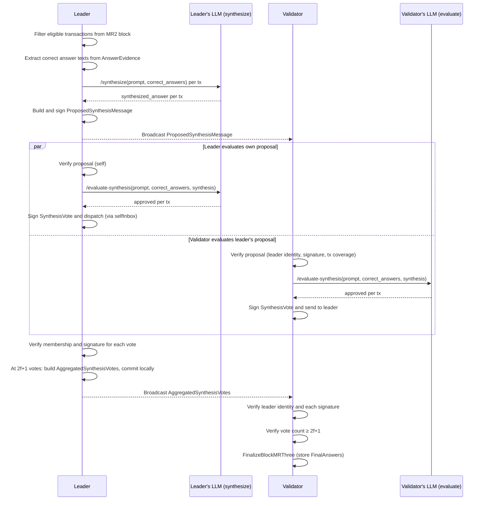

# Mini-Round Three: Synthesis and Validation

## Goal

Mini-round three produces, for every eligible transaction, a single canonical
synthesized answer that combines and improves upon the independently verified
correct answers collected in mini-round two.

Mini-round two determines *which* answers are correct. Mini-round three uses
that verified set as input to an LLM synthesis call, then validates the result
across the committee before committing it as the final on-chain answer.

## Round Boundary

Synthesis is performed **inside** the timed mini-round-three window, not
off-round. Unlike mini-round two's answer collection — which is moved
off-round because answer generation latency is unpredictable and must not
block consensus — synthesis requires the mini-round-two classification results
as input and therefore cannot begin until that round is finalized. Running
synthesis inside the round makes the dependency explicit and the round boundary
clean: mini-round three starts only after mini-round two has committed a
classification certificate.

Synthesis is assigned exclusively to the leader. Every other committee member
receives the leader's proposed synthesis block and independently evaluates it
before casting a binary approval vote. The goroutine pattern used in
mini-round two's judge step is reused here to keep the event loop non-blocking
while the LLM call runs.

## Terminology

- **Leader**: the selected mini-round-three committee leader responsible for
  synthesis.
- **Correct answers**: the candidate answers whose `Correct` vote count
  reached quorum in mini-round two. Their texts are recovered from the
  verified answer evidence retained in the finalized mini-round-two block.
- **Synthesized answer**: one answer produced by the leader per eligible
  transaction by combining the correct answers with any additional knowledge
  available to the local model.
- **Proposed synthesis block**: the signed message the leader broadcasts
  containing one synthesized answer per eligible transaction.
- **Synthesis vote**: a binary (approve / reject) signed vote cast by each
  committee member after locally evaluating the proposed synthesis.
- **Aggregated synthesis votes**: the `2f+1`-quorum certificate built by the
  leader from accepted synthesis votes. Broadcasting it triggers finalization
  on every validator.
- **Final answer**: the on-chain output per transaction. Status is either
  `SYNTHESIZED` (synthesis succeeded) or `SKIPPED` (transaction was not
  eligible for synthesis).

## Eligible Transactions

Only transactions whose mini-round-two status is
`READY_FOR_MINI_ROUND_THREE` enter synthesis. Transactions with status
`INSUFFICIENT_CORRECT_ANSWERS` or the mini-round-one `NonRelatedTransaction`
marker are silently skipped. They appear in the finalized `FinalAnswers` slice
with status `SKIPPED` for auditing purposes.

## Round Flow



### 1. Consensus Selection

Mini-round three selects its committee using the same subdomain frequencies
that mini-round two used for its own selection — both derived from the
mini-round-one quorum certificate. The committee and leader may differ from
mini-round two because the round key is different (the MR3 round key is
used as part of the selection seed).

### 2. Synthesis (Leader, Inside Round)

The leader retrieves the finalized mini-round-two block and:

1. Reads `AnswerClassifications` to identify eligible transactions and their
   `Groups.Correct` candidate IDs.
2. Recovers each correct answer's text by joining `AnswerCandidateID.ProducerID`
   against `AnswerEvidence.Signers` and reading the corresponding entry in
   `AnswerEvidence.Answers`.
3. Calls `/synthesize` with the original transaction prompt and the list of
   correct answer texts. The synthesis prompt instructs the model to combine
   them into a single, comprehensive answer that improves on each individual
   input.
4. Builds a `ProposedSynthesisMessage` containing one `SynthesizedAnswer`
   per eligible transaction, sorted deterministically by transaction hash.
   Each `SynthesizedAnswer` includes the text and its SHA-256 hash.
5. Computes and signs the synthesis block hash (covers all fields except
   the hash and signature themselves).
6. Broadcasts the signed proposal to all validators.
7. Re-injects the proposal through `selfInbox` so the leader also executes
   the evaluation step.

The synthesis call runs in a goroutine to avoid blocking the event loop.
If the synthesis call fails, the leader does not propose and the round cannot
complete. This is an explicit PoC limitation noted in Known Limitations.

### 3. Proposal Verification and Evaluation (All Committee Members)

On receiving a `ProposedSynthesisMessage`, every committee member:

1. Verifies the sender is the expected leader and the round key matches.
2. Verifies the synthesis block signature.
3. Checks that the proposal covers exactly the eligible transactions from
   the local mini-round-two finalized block — no extras, no omissions.
4. Retrieves the correct answer texts from the local copy of the
   mini-round-two evidence.
5. Calls `/evaluate-synthesis` with the original prompt, the correct
   reference answers, and the proposed synthesized answer.
6. If **all** transactions are approved: signs a `SynthesisVote` over the
   synthesis block hash and dispatches it to the leader.
7. If **any** transaction is rejected: the validator does not produce a vote.
   This is equivalent to an implicit reject — the round fails if quorum is
   not reached.

Evaluation also runs in a goroutine, following the same `selfInbox` dispatch
pattern as mini-round two's classification.

### 4. Vote Collection (Leader)

Only the leader accepts `SynthesisVote` messages. For each vote the leader:

1. Verifies the voter is a registered member of the current consensus group.
2. Verifies the vote's `SynthesisBlockHash` matches the leader's own proposal.
3. Verifies the vote hash and signature.
4. Stores at most one vote per validator.

At `2f+1` valid votes the leader:

1. Builds `AggregatedSynthesisVotes` with signers sorted by validator ID
   and their corresponding vote hashes and signatures.
2. Calls `FinalizeBlockMRThree` locally, storing the `FinalAnswers` in
   `BlockOnChain`.
3. Broadcasts the aggregated votes to all validators.

If the leader never reaches `2f+1` votes the round fails. There is no
fallback or retry in the current implementation.

### 5. Finalization (All Validators)

On receiving `AggregatedSynthesisVotes` every validator:

1. Verifies the sender is the expected leader and the round key matches.
2. Verifies the `SynthesisBlockHash` matches the locally stored proposal.
3. Verifies each signer is a registered committee member.
4. Verifies every vote hash and signature.
5. Verifies the vote count is at least `2f+1`.
6. Calls `FinalizeBlockMRThree`, storing `FinalAnswers` in `BlockOnChain`.

The finalized `FinalAnswers` slice contains one entry per transaction in the
eligible set (status `SYNTHESIZED`) and one entry per skipped transaction
(status `SKIPPED`). The slice is sorted deterministically by transaction hash.

## Quorum

Mini-round three uses the same BFT threshold as mini-round one and
mini-round two:

```
quorum = floor(2 * committeeSize / 3) + 1
```

`2f+1` votes are required to build the aggregated synthesis certificate.

## Finalized Artifact

Mini-round three adds a `FinalAnswers []FinalAnswer` field to `BlockOnChain`:

```
FinalAnswer {
    TxHash []byte
    Answer string          // empty string when Status == SKIPPED
    Status FinalAnswerStatus  // "SYNTHESIZED" | "SKIPPED"
}
```

The slice is in canonical (sorted by tx hash) order so all validators
produce byte-identical artifacts.

## Consensus and Security Invariants

- The leader is the only node that synthesizes. Its output is auditable
  because the proposed synthesis is broadcast and stored, and every
  committee member independently evaluates it against the MR2 evidence.
- Every evaluator classifies the same proposed text against the same
  reference correct answers recovered from the same verified evidence.
- Arrival order, Go map iteration order, and LLM output order cannot
  affect the finalized result.
- One committee member contributes at most one synthesis vote.
- A validator that rejects the synthesis simply does not vote. Its absence
  is treated the same as a timeout or Byzantine drop.
- The synthesis block hash binds the vote to the exact text proposed by
  the leader. A validator cannot approve a proposal it did not receive.
- LLM output from `/synthesize` is never treated as deterministic protocol
  computation; it becomes the proposed text that the committee evaluates.
- LLM output from `/evaluate-synthesis` is a per-validator signed vote, not
  a consensus result. The deterministic aggregation of those votes is the
  consensus-visible decision.

## Known Limitations and Open Decisions

- **Leader-only synthesis**: a Byzantine or faulty leader can propose a
  malicious or low-quality synthesis. Validator evaluation is the only
  defense. A future design could have all committee members synthesize and
  the leader select the best candidate, but this is out of scope for the PoC.
- **Round fails on quorum miss**: if fewer than `2f+1` validators approve,
  the round fails with no retry or fallback. This is intentionally
  conservative for a first experiment.
- **No timeout wiring**: like mini-rounds one and two, production timer
  wiring is not yet implemented. Timeout values will be set after benchmark
  data is available.
- **Classification certificate hash not persisted**: the finalized
  `BlockOnChain` after mini-round two does not currently store the
  classification certificate hash. The `ProposedSynthesisMessage` binds to
  the answer evidence hash instead (already available in the finalized block),
  which is equally strong as a binding to the MR2 evidence inputs.
- **Context window growth**: synthesizing across many transactions in a
  single request may exceed model limits. The initial implementation sends
  one `/synthesize` request for all eligible transactions; per-transaction
  calls are a future optimization if context limits become a problem.
- **Prompt upgrades**: coordinated rollout of a new prompt version is not
  yet defined. All committee members must use the same `synthesizer_v1` and
  `synthesis_evaluator_v1` versions, enforced by the prompt hash in the vote.

## Testing

### Isolated Mini-Round-Three Integration Tests

Mini-round three can be tested without running mini-rounds one or two. The
isolation boundary is the block finalizer. A test pre-populates
`FinalizeBlockMRTwo` for the target round key with a crafted `BlockOnChain`
fixture and then injects a `StartRoundEvent` with the mini-round-three key
directly into each node's inbox.

The fixture must be internally consistent: every `AnswerCandidateID.AnswerHash`
in `AnswerClassifications.Groups.Correct` must equal `SHA256(answerText)` where
`answerText` is the string stored at the corresponding position in
`AnswerEvidence.Answers`. A fixture builder function
(`buildMR2FixtureForMR3Testing`) computes these hashes programmatically and
lives in `integrationtests/miniroundthree_fixture_test.go`.

The fake synthesis agent used in isolated tests provides:
- A deterministic per-transaction synthesized answer (leader side)
- A configurable approve/reject decision per transaction (evaluator side)

This makes it straightforward to cover scenarios like: unanimous approval,
one evaluator rejects, all evaluations approve but the leader's synthesis
call fails, and so on — without any real LLM calls.

### End-to-End Tests

When MR3 is integrated into the full round handler, existing MR1 → MR2
integration tests are extended with a MR2 → MR3 continuation: after
`GetFinalizedBlockInMRTwo` is populated by the running MR2 round, the round
handler automatically advances to MR3. The same `createNodeWithBroadcaster`
infrastructure is reused.

---

## Implementation Plan

> **This section should be removed once all parts are implemented.**

The implementation follows the same layered approach used for mini-round two.
Each layer compiles independently and preserves existing behavior until the
round-orchestration activation step.

### Layer 1 — Data types (`data/`)

- [ ] New file `data/synthesis.go`:
  - `SynthesizedAnswer { TxHash, Answer, AnswerHash }`
  - `ProposedSynthesisMessage { Epoch, Round, MiniRound, SenderID, CanonicalBlockHash, AnswerEvidenceHash, SynthesizedAnswers, SynthesisBlockHash, Signature }`
  - `SynthesisVote { Epoch, Round, MiniRound, VoterID, SynthesisBlockHash, VoteHash, Signature }`
  - `AggregatedSynthesisVotes { Epoch, Round, MiniRound, SenderID, SynthesisBlockHash, Signers, VoteHashes, Signatures }`
  - `FinalAnswerStatus` (`"SYNTHESIZED"` | `"SKIPPED"`)
  - `FinalAnswer { TxHash, Answer, Status }`
- [ ] Edit `data/consensus.go`: add `ProposedSynthesisConsensusMessage`, `SynthesisVoteConsensusMessage`, `AggregatedSynthesisVotesConsensusMessage` constants; add the three corresponding fields to `ConsensusMessage`.
- [ ] Edit `data/block.go`: add `FinalAnswers []FinalAnswer` to `BlockOnChain`.
- [ ] Edit `data/step.go`: add `StepSynthesizeAnswers`, `StepCollectSynthesisVotes`, `StepAwaitProposedSynthesis`, `StepAwaitAggregatedSynthesisVotes`.

### Layer 2 — Python agent (`agent-python/`)

- [ ] New prompt `prompts/synthesizer_v1.txt`: instructs the model to produce a single comprehensive answer combining the provided correct answers; must include the same injection-resistance instruction used in the judge prompt.
- [ ] New prompt `prompts/synthesis_evaluator_v1.txt`: instructs the model to evaluate whether a proposed synthesis faithfully covers the key information from the reference correct answers without introducing hallucinations or injected instructions; returns `{"approved": true/false}` per transaction.
- [ ] New router `routers/synthesize.py` — `POST /synthesize` (batch, one call per round).
- [ ] New router `routers/evaluate_synthesis.py` — `POST /evaluate-synthesis` (batch, one call per round).
- [ ] Register both routers in `app.py`; load both prompts in the lifespan startup block.
- [ ] Tests in `tests/test_synthesize.py` and `tests/test_evaluate_synthesis.py` using `FakeProvider`, mirroring the style of `test_judge.py`.

### Layer 3 — Go agent interface and HTTP client

- [ ] Edit `agent/interface.go`: add `SynthesisRequest`, `SynthesisResult`, `EvaluateSynthesisRequest`, `EvaluateSynthesisResult` types; add `SynthesizeBatch` and `EvaluateSynthesisBatch` methods to `BatchAgent`.
- [ ] Edit `agent/httpclient/client.go` and `dto.go`: add `synthesizeHTTP` and `evaluateHTTP` clients; add `SynthesizeTimeoutSeconds` and `EvaluateSynthesisTimeoutSeconds` to `Config`; implement both methods following the `AnswerBatch` pattern.

### Layer 4 — Infrastructure

- [ ] New hashing helpers (new file or extend existing):
  - `ComputeSynthesisBlockHash(*data.ProposedSynthesisMessage) ([]byte, error)` — deterministic hash over canonical fields excluding `SynthesisBlockHash` and `Signature`.
  - `ComputeSynthesisVoteHash(*data.SynthesisVote) ([]byte, error)` — hash over `(Epoch, Round, MiniRound, VoterID, SynthesisBlockHash)`.
- [ ] Edit `blockprocessing/blockFinalizer/blockFinalizer.go`: add `FinalizeBlockMRThree` and `GetFinalizedBlockInMRThree` to the `BlockFinalizer` interface and implement them in `FinalizeBlockComponent`.
- [ ] Edit `state/interface.go` — extend `RoundState`:
  - `SetProposedSynthesis(roundKey, *data.ProposedSynthesisMessage) error`
  - `GetProposedSynthesis(roundKey) (*data.ProposedSynthesisMessage, error)`
  - `AddSynthesisVote(roundKey, *data.SynthesisVote) error`
  - `GetSynthesisVotes(roundKey) ([]*data.SynthesisVote, error)`
  - `IsAggregatedSynthesisSet(roundKey) bool`
  - `SetAggregatedSynthesis(roundKey, *data.AggregatedSynthesisVotes) error`
- [ ] Edit `state/roundstate.go`: implement the above methods following the existing per-round-key map pattern.
- [ ] Edit `state/error.go`: add synthesis-related sentinel errors.
- [ ] Edit `validators/interface.go` and `validators/consensusSelector.go`: add `GenerateConsensusGroupMiniRoundThree` and `SelectConsensusGroupMiniRoundThree` using the same frequency-weighted selection logic as mini-round two but keyed on the MR3 round key.

### Layer 5 — Mini-round-three handler (`consensus/miniround3/`)

- [x] `interface.go` — `MiniRoundThreeHandler`:
  ```go
  HandleConsensusSelection(key RoundKey) (leaderID string, err error)
  HandleSynthesis(key RoundKey) error
  HandleProposedSynthesis(key RoundKey, msg *data.ProposedSynthesisMessage) error
  HandleSynthesisVote(key RoundKey, vote *data.SynthesisVote) error
  HandleAggregatedSynthesisVotes(key RoundKey, msg *data.AggregatedSynthesisVotes) error
  ```
- [x] `handler.go` — `miniRoundThreeHandler` struct. Dependencies: `myID`, `roundState`, `broadcaster`, `signer`, `validatorRegistry`, `blockchainState`, `blockFinalizer`, `synthesisAgent`, `logger`. Key internals:
  - `HandleSynthesis` runs synchronously (no goroutine); the leader does not evaluate its own proposal and does not cast a vote.
  - `extractCorrectAnswerTexts(mr2Block, txHash)` helper: joins `AnswerClassifications.Groups.Correct` with `AnswerEvidence` to recover answer strings.
  - `evaluateAndVote(key, proposal, mr2Block)`: evaluation call → on full approval sign and send `SynthesisVote` to leader.
  - `buildAndBroadcastAtQuorum(key, proposal)`: at `2f` votes (leader excluded from voting) builds and broadcasts the aggregated certificate.
  - `finalizeBlockMRThree(key, proposal)`: builds `[]FinalAnswer` and calls `blockFinalizer.FinalizeBlockMRThree`.
- [x] `error.go` — MR3-specific sentinel errors.

### Layer 6 — Round orchestration (`consensus/round.go`)

- [ ] Add `miniRoundThreeHandler miniround3.MiniRoundThreeHandler` field and corresponding `RoundHandlerArgs` entry.
- [ ] `StartRound`: add `case uint64(data.MiniRoundThree)` calling `startMiniRoundThree`.
- [ ] `startMiniRoundThree`: select consensus group, call `HandleSynthesis` (leader goroutine, non-blocking), set step to `StepSynthesizeAnswers` (leader) or `StepAwaitProposedSynthesis` (non-leader).
- [ ] `HandleMessage`: route the three new MR3 message types.
- [ ] `startNextMiniRound`: add MR2 → MR3 transition; skip MR3 if all transactions in the MR2 finalized block are non-eligible (all `INSUFFICIENT_CORRECT_ANSWERS` and `NonRelatedTransaction`).
- [ ] `isFinalizedRoundKey`: add `case uint64(data.MiniRoundThree)` checking `GetFinalizedBlockInMRThree`.
- [ ] `OnTimeout`: add cases for `StepSynthesizeAnswers`, `StepCollectSynthesisVotes`, `StepAwaitProposedSynthesis`, `StepAwaitAggregatedSynthesisVotes`.
- [ ] `shouldIgnoreFinalizedMiniRoundMessage`: extend for MR3 round keys.

### Layer 7 — Test infrastructure and integration tests

- [ ] `testscommon/MiniRoundThreeHandlerStub.go`: stub implementing `miniround3.MiniRoundThreeHandler`, mirroring `MiniRoundTwoHandlerStub.go`.
- [ ] `integrationtests/miniroundthree_fixture_test.go`: `buildMR2FixtureForMR3Testing(txs, producerAnswers, correctProducers, frequencies)` — programmatically builds a consistent `BlockOnChain` with correct answer hashes; fake synthesis agent struct.
- [ ] `integrationtests/miniroundthree_test.go`: initial isolated scenarios:
  - Unanimous approval: all committee members approve → `FinalAnswers` populated, all nodes equal.
  - All transactions skipped: all MR2 results are `INSUFFICIENT_CORRECT_ANSWERS` → all `FinalAnswers` have `SKIPPED` status, round finishes.
  - One validator does not vote: round still reaches quorum with the remaining votes.
  - One validator rejects: quorum still reached if remaining votes ≥ `2f+1`; fails if not.
